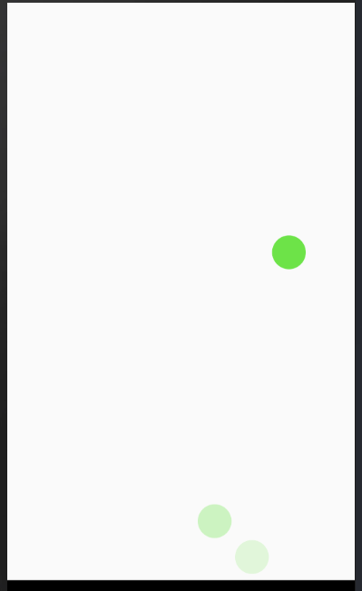

# Animating balls

###### [back to main](../../../README.md)

This project animates balls through translateY.
I use timing, sequence, delay and loop from Animated api.

This code was tested only on android.

#### reference

[rn-animated](https://reactnative.dev/docs/animated)
