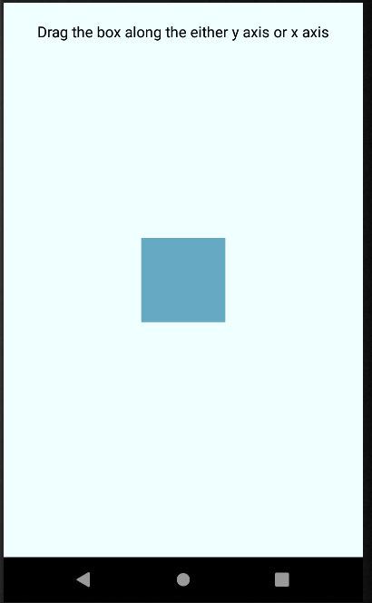

# panResponder

###### [back to main](../../../)

This project use panRespnder api to animate the box and interpolate opacity and backgroundColor

Remember! The box is in the center of the window and its position is x: 0 and y: 0. 

#### reference

- [gesture-responder-system](https://reactnative.dev/docs/gesture-responder-system)

- [panResponder](https://reactnative.dev/docs/panresponder)
