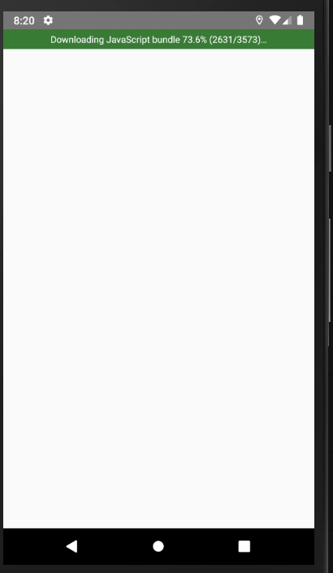

# Signin
###### [back to main](../../../README.md)

In this project it was used:

- Animated
    - timing
    - delay (simulate a task)
    - parallel
    - stagger
    - sequence

#### reference

[Animated api](https://reactnative.dev/docs/animated)